# Lab 9: Network Forensics and Packet Analysis

## Overview

Network forensics involves the investigation of **network traffic patterns** and data captured in transit between computing devices. These techniques provide insight into the **source, scope, and methodology of attacks**, while supplementing traditional host-based forensic investigations.

With the rapid shift to remote work and the exponential rise in ransomware, breaches, and other cyber incidents, the importance of **network forensic analysis** has increased significantly. Organizations rely on network monitoring and packet analysis to detect anomalous behavior, reconstruct communication streams, and strengthen security controls.

Network forensics serves two primary purposes:

- **Monitoring networks for anomalous traffic and intrusions** as part of a security operations program  
- **Analyzing captured traffic to reconstruct files and communication streams**, often for investigative or law enforcement purposes  

In this lab, network traffic was captured and analyzed using **Wireshark**, and forensic evidence was collected directly from **routers and a firewall** in a multi-device virtual environment.

---

## Lab Objectives

Upon completing this lab, I will be able to:

- **Perform packet capture** using Wireshark  
- **Conduct packet analysis** using protocol and field filters  
- **Analyze router configurations for forensic evidence**  
- **Examine firewall logs for suspicious activity**  
- **Identify and interpret suspicious network traffic**  
- **Reassemble transmitted files from captured packets**  

---

## Lab Environment

**Virtual Machines**

- vWorkstation (**Windows Server 2019**)  
- router1 (**Ubuntu 16**)  
- router2 (**Ubuntu 16**)  
- router3 (**Ubuntu 16**)  
- pfSense (**FreeBSD 2.4**)  
- AttackLinux01 (**Kali Linux**)  

---

## Tools Used

- **Wireshark**
- **PuTTY**
- **Quagga**
- **pfSense**

---

## Section 1: Packet Capture and Router Analysis

### Packet Capture with Wireshark

Network traffic was captured and analyzed using **Wireshark**, focusing on filtering and isolating relevant packets.

---

### Timestamp-Sorted Traffic

Captured packets were sorted by timestamp to establish communication order.

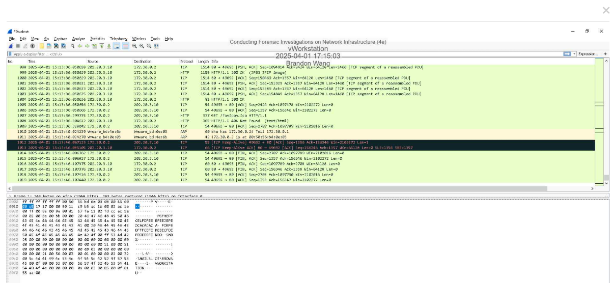

---

### IP-Filtered Traffic

Traffic was filtered by specific IP addresses to isolate communication between targeted hosts.

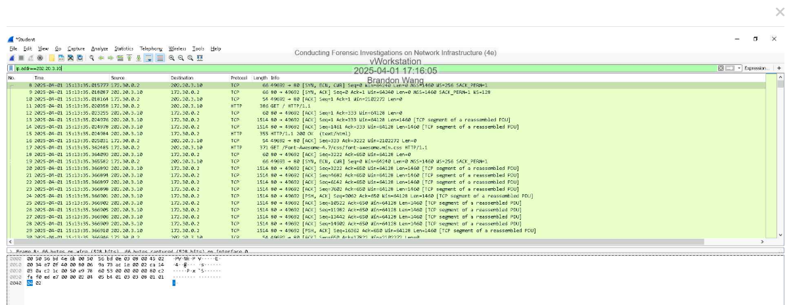

---

### Port-Filtered Traffic

Port-based filtering was applied to identify service-specific traffic.

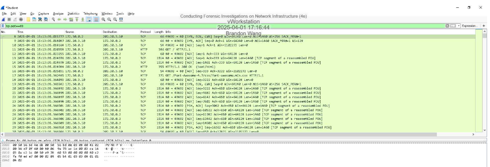

---

### TCP Push Flag Filtering

Packets containing the **TCP Push (PSH) flag** were filtered to identify actively transmitted data.

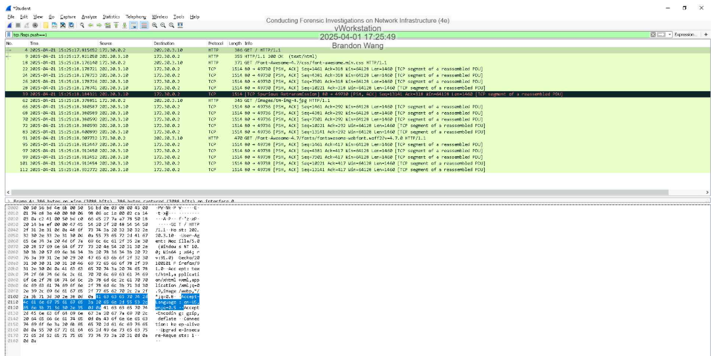

---

### HTTP-Filtered Traffic

HTTP protocol filters were applied to isolate web traffic.

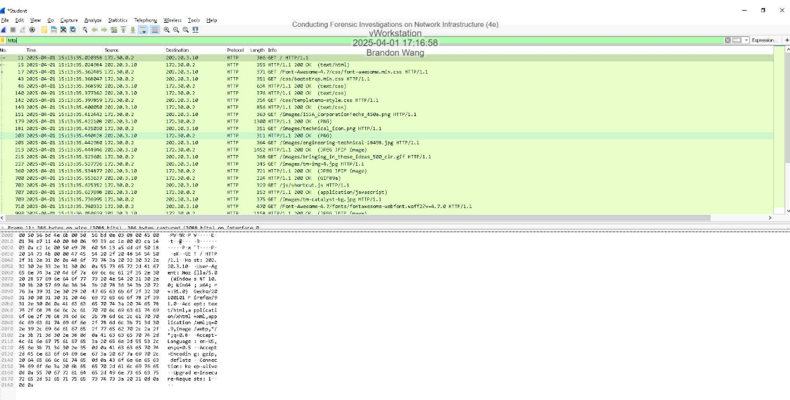

**Findings**
- Identified request and response traffic  
- Examined headers and payload data  

---

### Router Analysis via Command Line

Basic router commands were used to gather system and network configuration details.

---

#### Router Interface Details

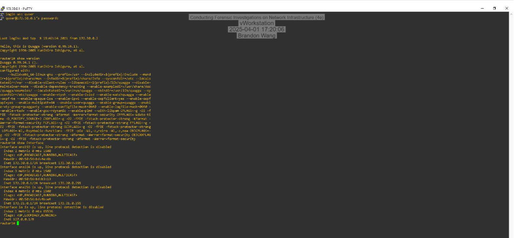

---

#### Router ARP Table

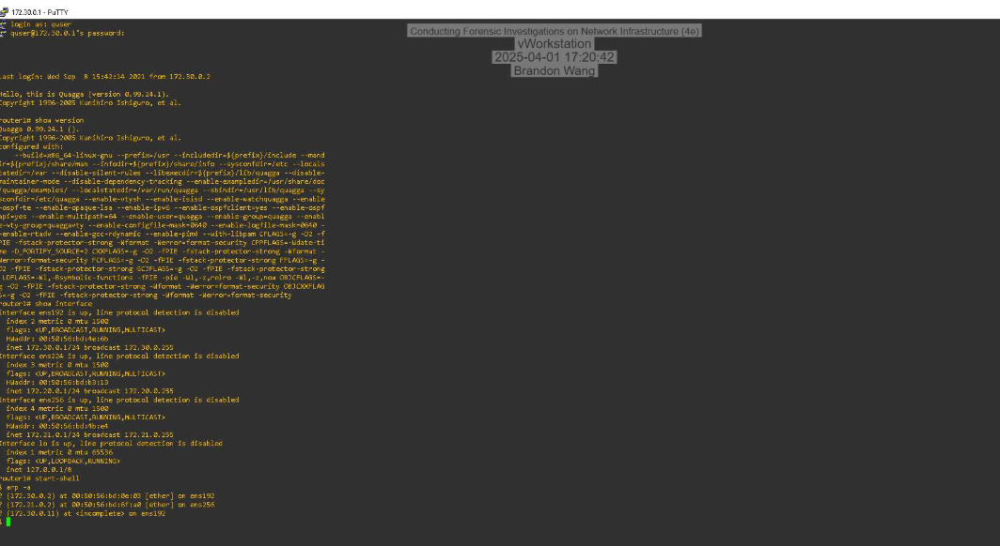

---

#### IP Routing Table

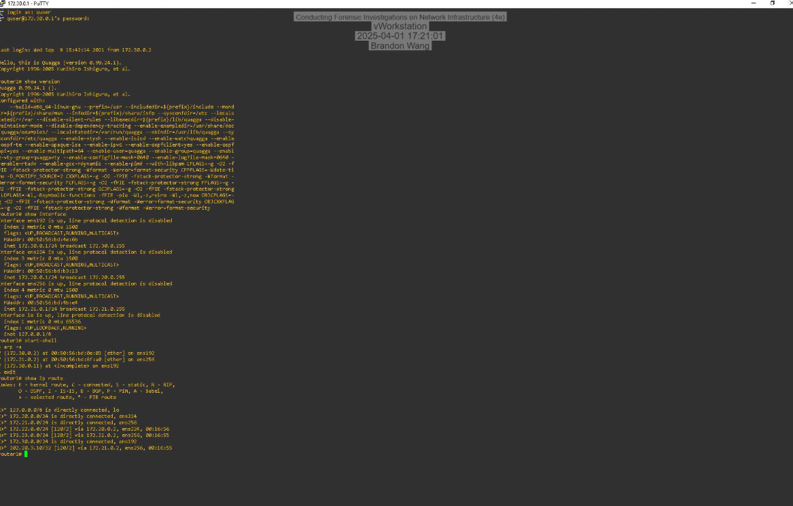

---

#### Currently Running Configuration

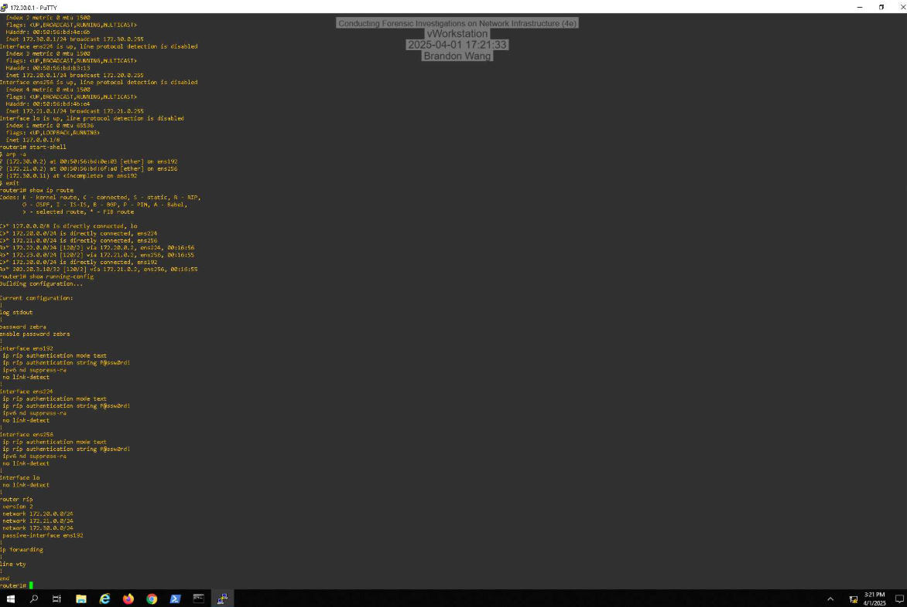

**Significance**
- Identified active interfaces and routing behavior  
- Verified ARP mappings  
- Examined routing entries for anomalies  

---

## Section 2: Advanced Packet Analysis and Firewall Investigation

### Secure File Transfer Analysis

A successful transfer of the `secureTopo.png` file was identified and analyzed.

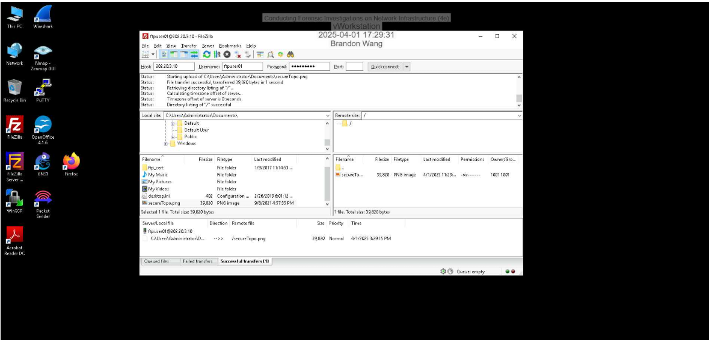

---

### Passive FTP Port Identification

The passive port specified by the FTP server was identified within the **Packet Details pane**.

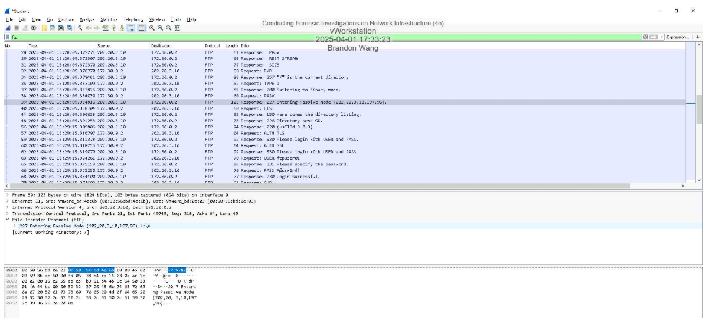

---

### Time to Live (TTL) Field Analysis

The **Time To Live (TTL)** field was examined to assess packet routing behavior.

---

### Follow TCP Stream Analysis

The **Follow TCP Stream** feature was used to reconstruct communication sessions.

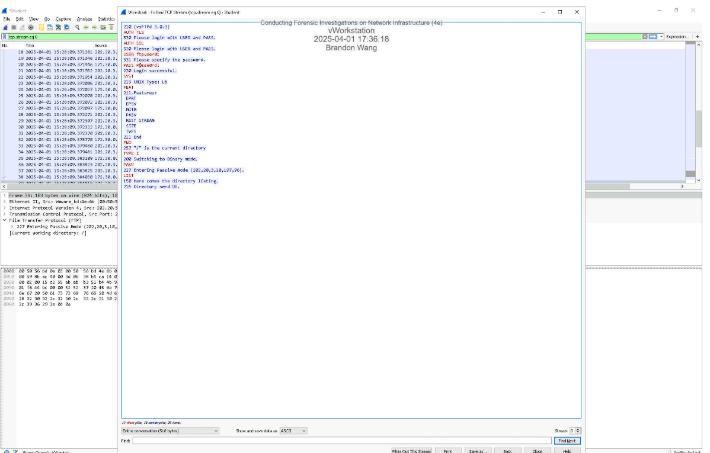

---

### Reconstituted PNG File

The transferred PNG file was reconstructed from captured packets.

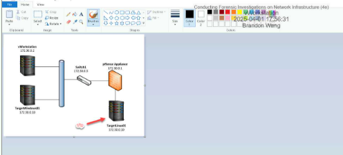

**Significance**
- Demonstrated file reconstruction from packet data  
- Validated integrity of transferred content  

---

### Firewall Log Examination (pfSense)

Firewall logs were reviewed to identify blocked or suspicious traffic.

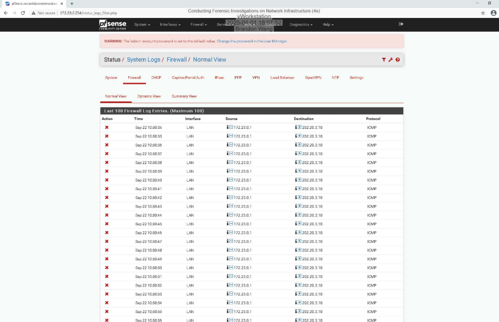

---

### Resolved Firewall Log Entries

Firewall log entries were resolved to identify associated hostnames and services.

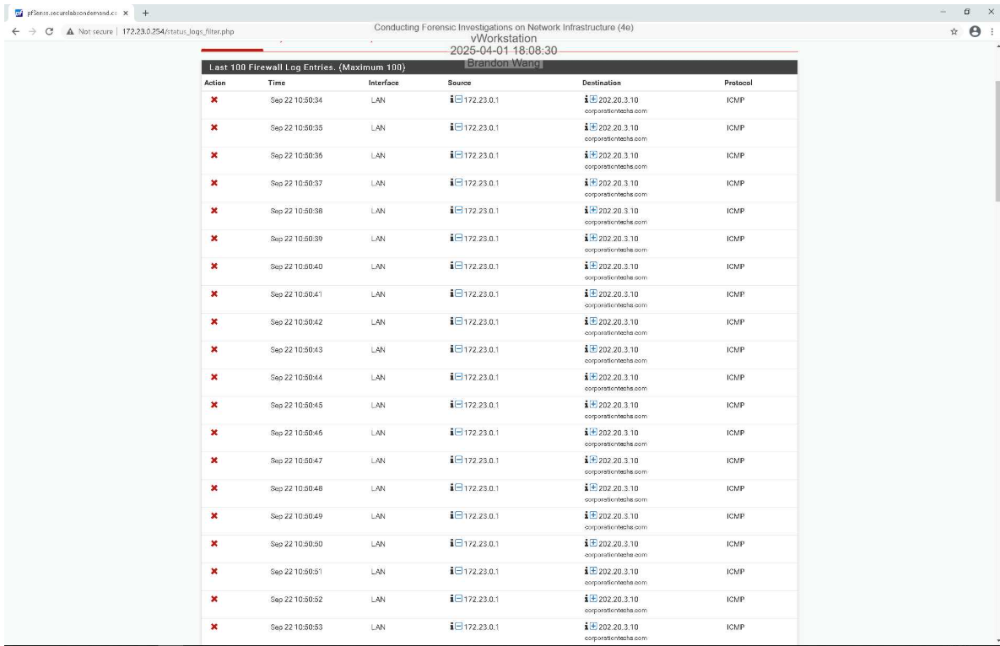

**Findings**
- Identified allowed and denied connections  
- Correlated firewall logs with captured traffic  

---

## Section 3: Independent Investigation and Route Analysis

### Non-RIP Route Discovery

A non-RIP route was discovered on the target router and analyzed.

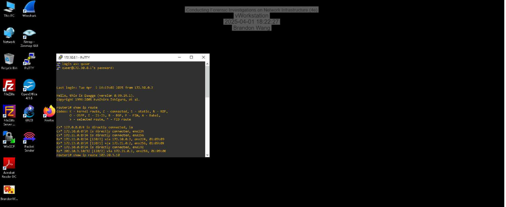

**Findings**
- Identified route not propagated via RIP  
- Assessed routing implications  

---

### Outgoing Connection Attempt

An outgoing connection attempt was identified and documented.

**Recorded Details**
- **Destination IP Address:** [202.20.3.10]  
- **Destination Port Number:** [1337]  

**Significance**
- Determined potential external communication  
- Evaluated legitimacy of connection attempt  

---

## Summary and Key Takeaways 

By completing this lab, I was able to gain hands on experience in **network forensic investigation**. This consisted of live packet capture, protocol filtering, firewall log examination, and router analysis. 
This investigation shows how attacker behavior can be revealed through network-level evidence, in which file transfers and abnormal communication patterns were the key points of traceable evidence. 
The methods used in this lab reflect real-world workflows used in **Security Operations Centers (S)C), law enforcement investigations, and incident response teams**. This highlights the essential role of packet analysis in modern cybersecurity operations. 
