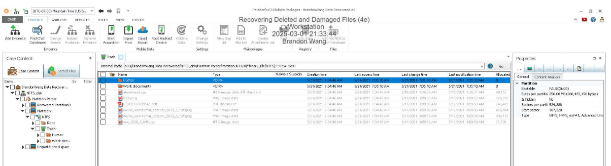
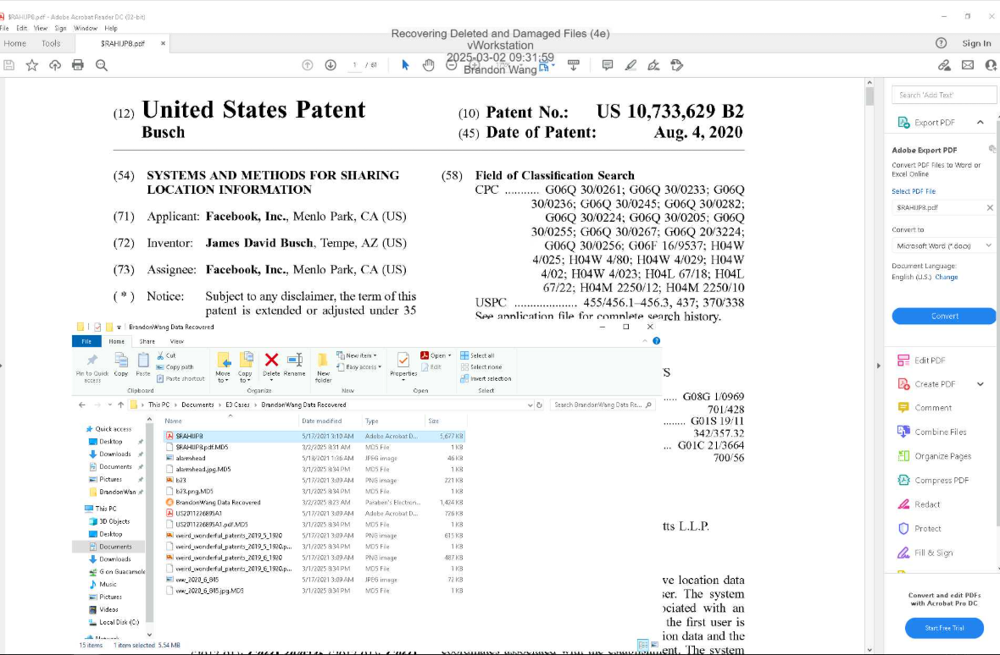
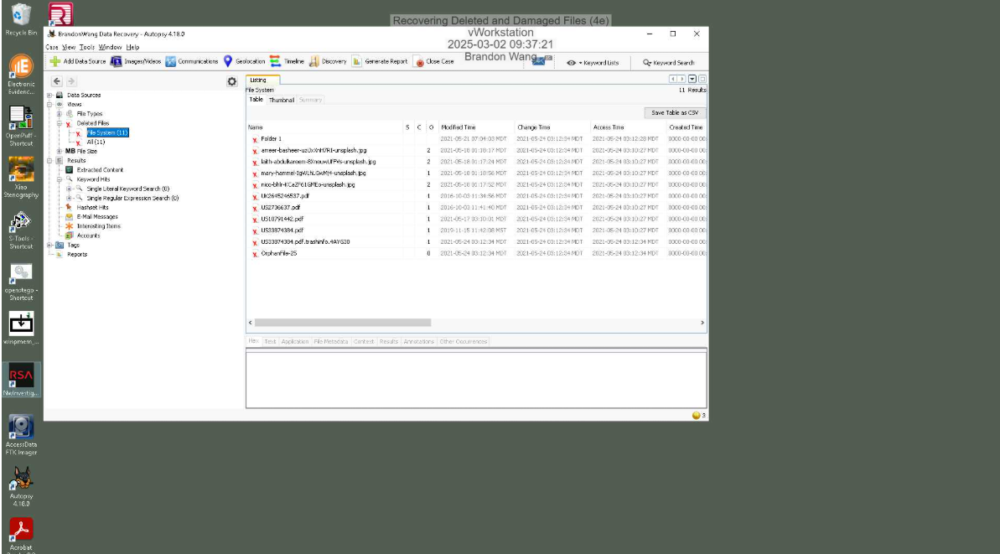
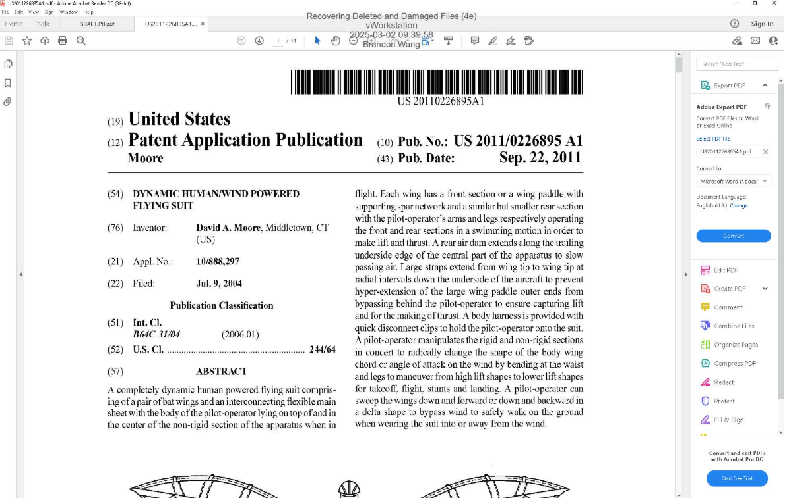
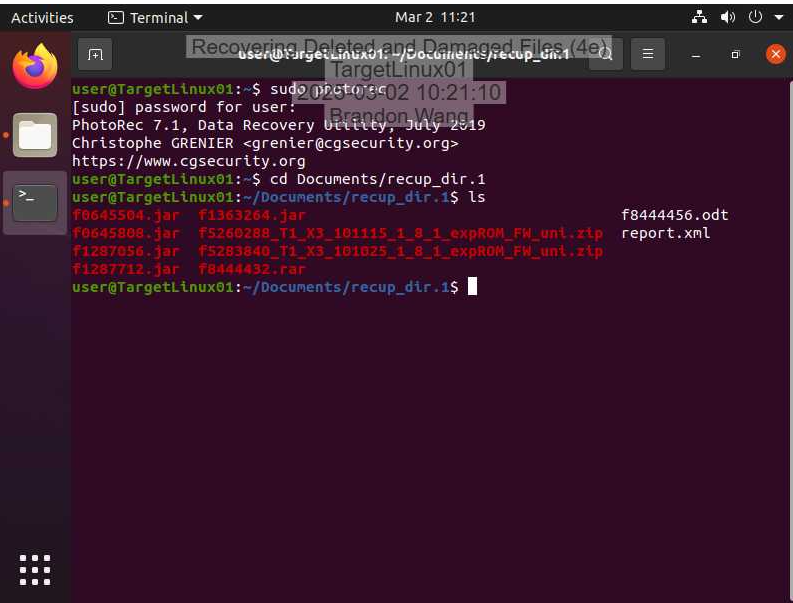
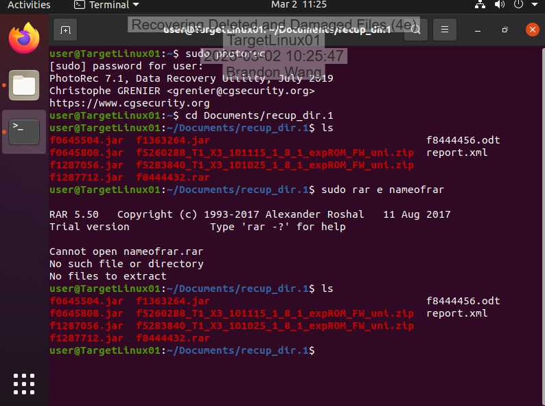
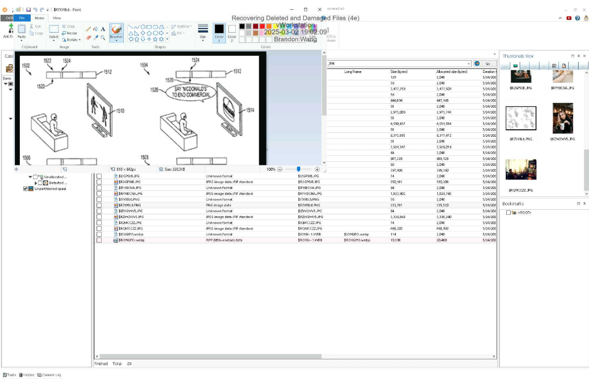
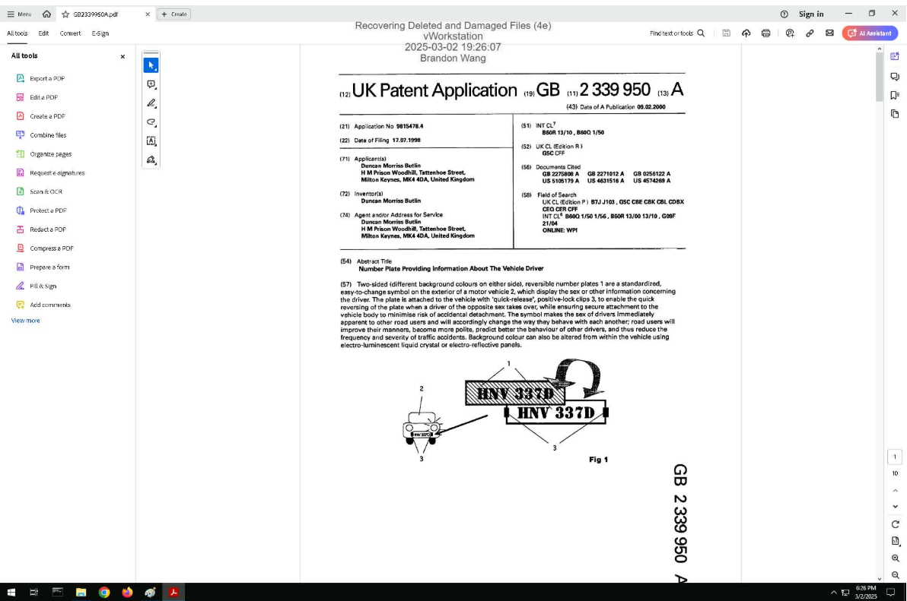

# Lab 3 – Data Recovery and File System Forensics

## Overview

This lab focused on recovering deleted data from multiple file systems and understanding how file deletion actually works at the operating system level. Although users often believe that emptying the Recycle Bin permanently deletes a file, the operating system typically removes only the reference to the file in the file table. The underlying data remains on disk until it is overwritten.

In this lab, I analyzed NTFS and Ext4 drive images using Paraben’s E3 and Autopsy. I also used PhotoRec to perform data carving and recover files when metadata was partially missing. Finally, I validated recovery techniques across additional file systems.

---

# SECTION 1 – Recovery from Drive Images

## NTFS Recovery Using E3

I began by examining a Windows NTFS drive image in Paraben’s E3. I navigated to the Trash folder to identify deleted files that were still recoverable.

This view confirms that deleted files still exist within the image despite removal from the active file table.

I then opened the patent file in the File Viewer to verify its contents.

This confirms successful recovery of deleted intellectual property evidence from an NTFS file system.

---

## Ext4 Recovery Using Autopsy

Next, I analyzed a Linux Ext4 drive image using Autopsy. I reviewed the list of deleted files within the file system structure.

After identifying the deleted patent file, I restored it and verified its contents.

This demonstrates that even in Linux environments, deletion removes references but does not immediately destroy the data.

---

# SECTION 2 – Data Carving with PhotoRec

In this section, I used PhotoRec to recover files directly from raw disk sectors without relying on file system metadata. This technique is especially useful when metadata is corrupted or intentionally wiped.

The recovery of compressed files confirms that data carving can successfully reconstruct files based on file signatures alone.

I then extracted backup files from a recovered RAR archive.

This demonstrates layered recovery — first carving the archive, then extracting its internal contents.

---

# SECTION 3 – Cross-File System Validation

To validate recovery techniques across platforms, I recovered the patent file from an additional file system image (FAT32 or APFS).

This confirms that forensic recovery principles apply consistently across different file system architectures.

---

# Summary and Key Takeways 

The main takeaways I had from this lab was that deleting a file does not immediately remove the file's data. This turns out to be a key forensic principle. So what actually happens? The operating system only removes the references to the file while still leaving the underlying data intact until it is overwritten. 
Utilizing Autopsy, E3, and PhotoRec, I was able to successfully recover deleted evidence from NTFS, Ext4, FAT32, and APFS files systems. I recovered through both metadata based restoration as well as signature based data carving techniques. 
Ultimately, deleted data remains a viable source of forensic evidence that most people being investigated probably aren't aware about. It's viable unless the data is securely overwritten or physically destroyed. 
