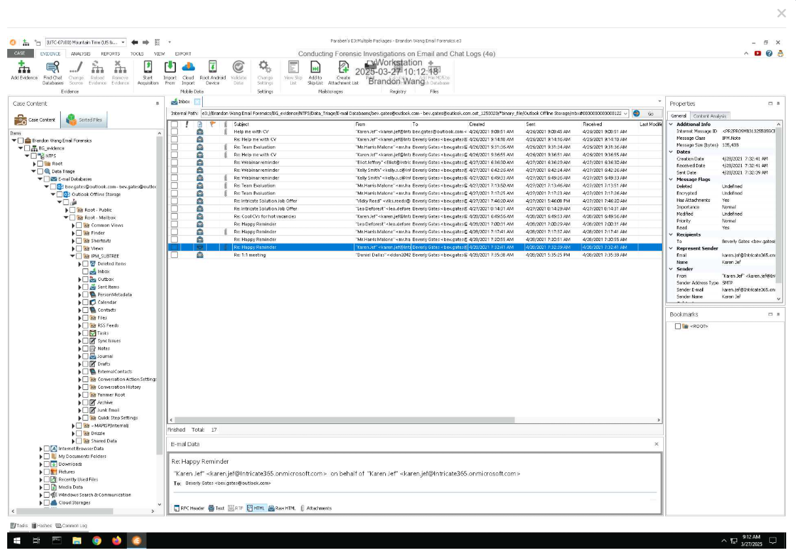
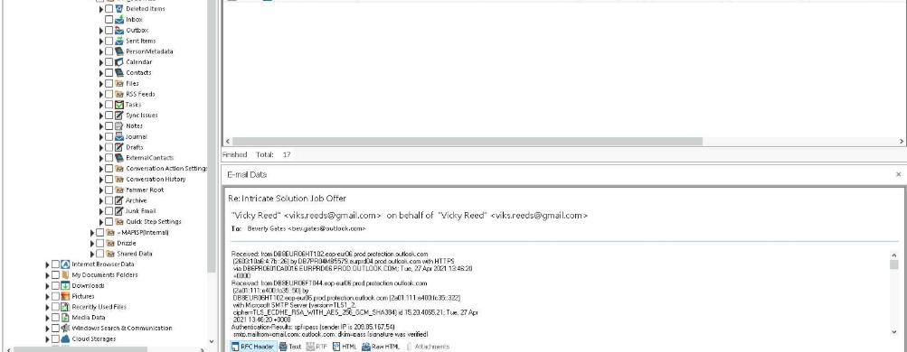
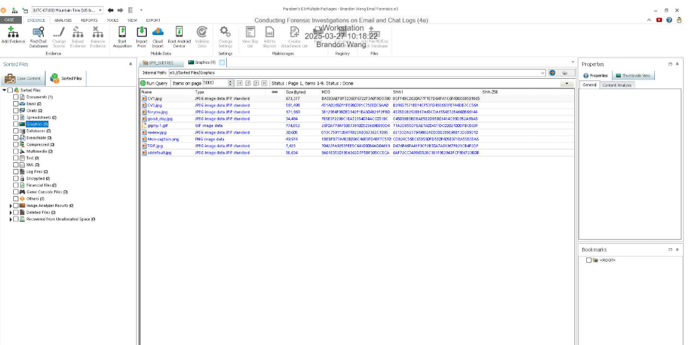
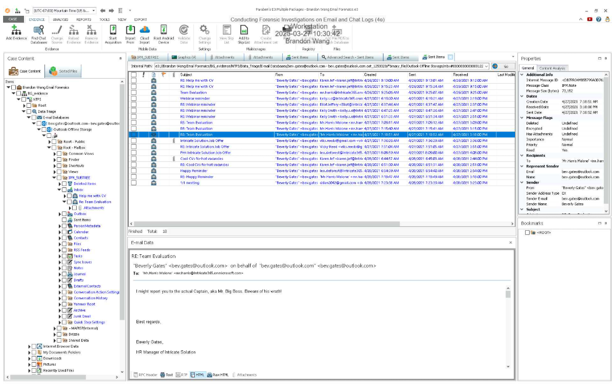
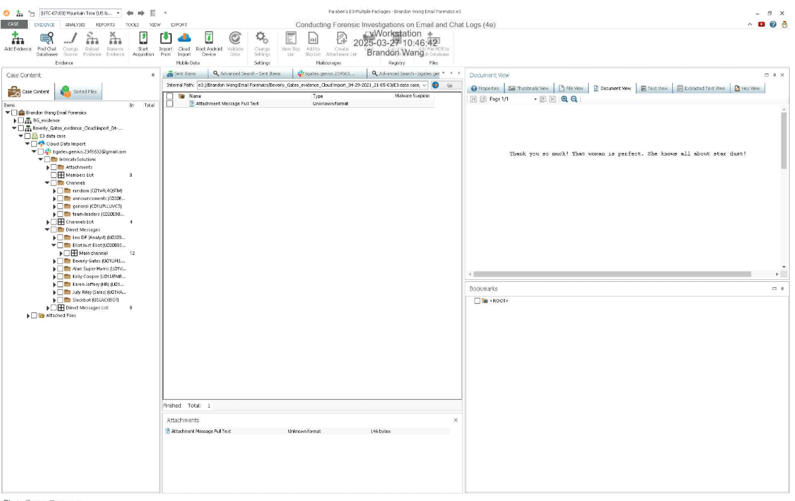
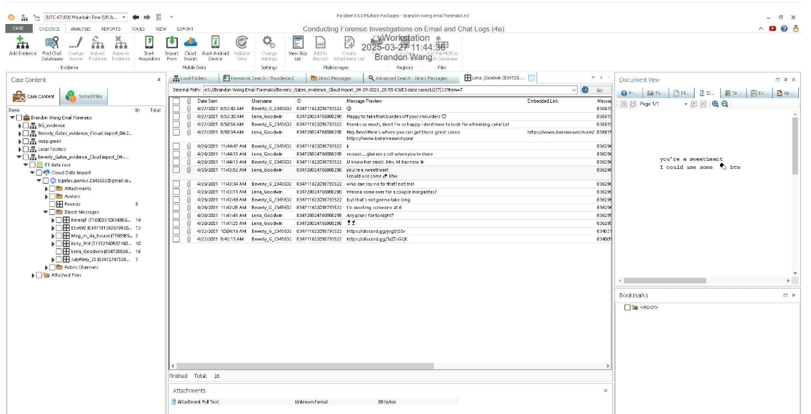
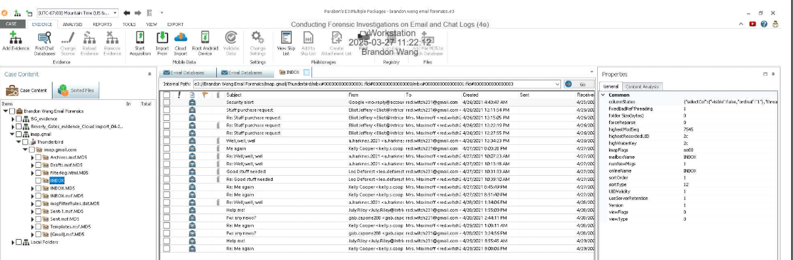
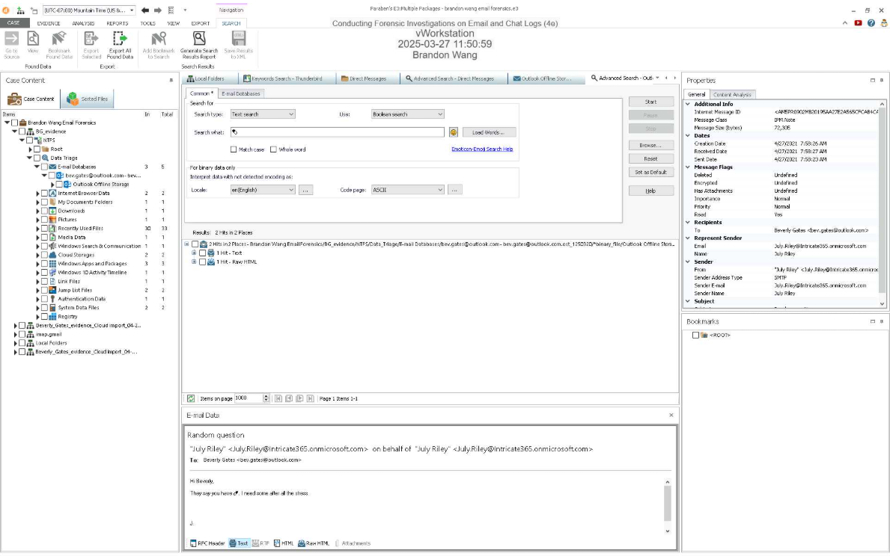

# Lab 7 – Email and Chat Log Forensics

## Overview

This lab focused on the forensic analysis of email and instant messaging platforms, including Outlook, Thunderbird, Slack, and Discord. Because email and chat applications are widely used as primary communication tools in both personal and professional environments, they frequently serve as critical sources of evidence.

Using Paraben’s E3, I analyzed email headers, performed targeted searches, categorized attachments, and examined chat databases to reconstruct communications and identify key participants.

---

# SECTION 1 – Email Header and Targeted Search Analysis

## Email Header Analysis

I began by analyzing the “Happy Reminder” email header in E3. Email headers contain routing metadata that reveals the sender’s IP address, mail servers involved, and timestamps.

From the header, I identified the originating IP address and verified the transmission path. This demonstrates how header analysis can help validate message authenticity and trace message origin.

---

## Attachment Categorization Using Content Analysis

Next, I used E3’s Content Analysis function to categorize email attachments by file type, including graphics.

This functionality allows investigators to quickly identify potentially suspicious attachments without manually reviewing every email.

---

## Targeted Keyword Search

Using E3’s Advanced Search function, I applied keyword filters to locate communications referencing the “Big Boss.”

This demonstrates how targeted searching improves investigative efficiency by narrowing down large datasets to relevant evidence.

---

# SECTION 2 – Slack and Discord Database Analysis

## Slack Workspace Investigation

I examined the IntricateSolutions Slack workspace database to identify members, channels, and conversation content.

Slack databases store structured communication artifacts, including timestamps, user IDs, and message content. This enables reconstruction of conversation timelines and participant involvement.

---

## Discord Analysis

In Discord, I reviewed user relationships and conversation transcripts, including Beverly’s friend list and relevant message threads.

This confirms that chat applications maintain local artifacts that can be analyzed for evidence of communication and collaboration.

---

## Detailed Email Header Documentation

I analyzed the “Well, Well, Well” email header and documented:

- Sender’s email address: a.harknes.2021@protonmail.com  
- Mail server name: protonmail.com  
- Mail server IP address: 185.70.40.132  

This reinforces the importance of header analysis in tracing email transmission paths.

---

# SECTION 3 – Independent Investigation

In the final section, I independently searched the database for additional evidence and identified a relevant email thread returned in the search results.

This demonstrates the ability to conduct independent forensic analysis without guided instructions, mirroring real-world investigative scenarios.

---

# Summary and Main Takeaways

This lab showed me the forensic value of email headers and messaging databases. I learned that email headers provide the routing and origin information, which is crucial for determining attribution for actions. I also learned that chat application databases store structured artifacts in the event of an investigation, which makes it easier to reconstruct conversations.
By utilizing E3's Advanced Search and Content Analysis, I was able to identify relevant communications and extract key metadata. Ultimately, digital communication platforms preserve detailed artifacts which can be used to establish timelines, relationships, and intent in digital forensic investigations. 
